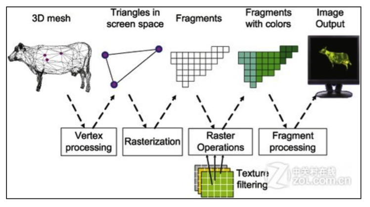

名词解释  

|名词|翻译解释|
|:---|---:|
|3D mesh|3D 网格|
|Vertex processing|顶点处理|
|Triangles in screen space||
|Rasterization|光栅化|
|Fragments|片元|
|RasterOperations|光栅化操作|
|Fragments with colors|带颜色的片元|
|Fagment processing|片元处理|
|Image output|图像输出|
