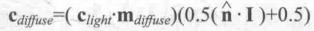

# 光照的公式

* 漫反射  
      
    漫反射光=(光源颜色·材质漫反射颜色)*max(0, 表面法线·指向光源的单位向量)  
* 半兰伯特漫反射模型  
      
    漫反射光=(光源颜色·材质漫反射颜色)*(0.5*(表面法线·指向光源的单位向量)+0.5)  

-----

* 高光反射  
      
    反射方向=2(表面法线·指向光源单位向量)表面法线-指向光源的单位向量  
    一般用函数计算 `reflect(入射方向,表面法线)`  
      
    高光反射=(光照颜色·反射光颜色)max(0,)
* Blinn模型高光反射公式  
      
    高光反射=光照颜色 X 反射颜色 X max(0, 表面法线X反射替代)^光泽度次方  
      
    反射替代 = 归一化(视角单位向量+指向光源的单位向量)