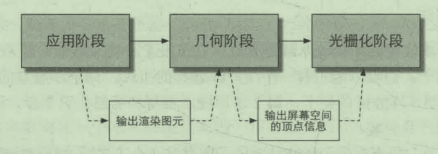
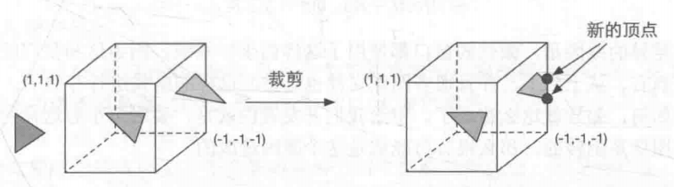
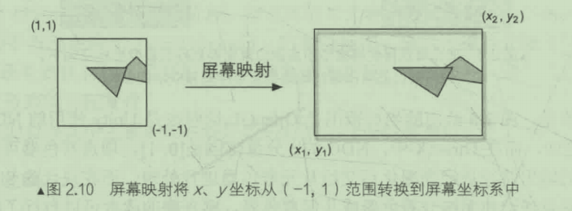
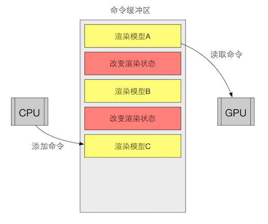

# 第二章 渲染流水线  

* 渲染流水线的最终目的，是渲染一张二维纹理。它的输入是一个相机，一些光源，一些shader和一些纹理。本章给出渲染流水线的概览。

## 综述

* 渲染流水线分为三个阶段：应用阶段-几何阶段-光栅化阶段。  
  
  
上图中应用阶段完全可控，几何阶段和光栅化阶段中绿色表示完全可以控制，蓝色表示可以配置，黄色标识完全不可以控制。
  * 应用阶段：该阶段主要有CPU完成。开发者具有完全的控制权。最主要输出的就是，渲染所需的几何信息，即渲染图元。渲染图元可以是点，线，三角面。  
    * 这一阶段主要分三步：  
      1. 从内存加载数据到显存
      2. 设置渲染状态
      3. 调用 Draw Call  
    * 在这一阶段主要有三个任务：
      1. 准备场景数据：相机的位置，视锥体，所有的模型，所有光源。
      2. 粗粒剔除。
      3. 设置每个模型的渲染状态：这些渲染状态包括但不限于材质(漫反射颜色，高光反射颜色)，使用的纹理，使用的 Shader 等。  
  * 几何阶段：
    1. 顶点着色器：处理单位为顶点，对每一个顶点进行坐标变换，逐顶点光照。  
       * 在这一步中会把顶点坐标从模型坐标转换到齐次剪裁空间。  
       * 我们可以修改顶点坐标来模拟水面，布料等效果。
    2. 曲面细分着色器/几何着色器：……
    3. 剪裁：对于图元中有一部分在视野内的，需要进行剪裁，生成新的顶点。  
      
    4. 屏幕映射：主要任务是把每个图元x，y坐标转换到屏幕坐标。
      
       * 注意，屏幕坐标是一个二维坐标系，并和分辨率有很大关系。
       * 屏幕映射得到的坐标系决定了，这个顶点对应屏幕上的那个像素，以及距离该像素有多远。
  * 光栅化阶段:  
    这个阶段主要任务是：计算每一个图元覆盖了那些像素，并为这些像素计算颜色。
    1. 三角形设置：计算光栅化一个三角网格所需要的信息。  
    2. 三角形遍历：计算每一个像素是否被一个三角网格覆盖。如果被覆盖则会生成一个片元(fragment)。这个阶段也叫（扫描变换）。  
    这一步输出的就是一个片元序列，注意一个片元并不是真正意义上的一个像素，而是很多状态的合集，这些状态用来计算每个像素的最终颜色。  
    这些状态包括(但不限于)屏幕坐标，深度信息，以及从其他几何阶段输出的顶点信息，例如法线，纹理坐标等。
      
    上图简化展示了在深度计算中的插值  
    3. 片元着色器：片元着色器的输入是对顶点信息进行插值后得到的结果，而输出是一个或者多个颜色值。  
      
    4. 逐片元操作：这是渲染流水线的最后一步。
      
       * 这一阶段有两个主要任务  
         1. 决定每个片元的可见性。这涉及很多工作，如深度测试，模板测试。  
         2. 对于通过了所有测试片元，就需要合并已经在颜色缓冲区中的值和该片元的颜色值。或者说是混合。  
        逐片元操作具有高度的可配置性
       * 在unity中给出的渲染流水线，其片深度测试在片元着色器之前，这可以避免一些不能通过测试的片元进入片元着色器。即Early-Z技术。透明效果的需求会导致各种测试无法提前，这就是其性能问题的原因。
    * 最终：当图元经过上面的层层计算和测试后，就会显示到我们屏幕上。我们的屏幕就是颜色缓冲区中的值。gpu使用双重缓冲来避免我们看到正在光栅化的图元。

## 疑惑解答

* 什么是Draw Call？
  * CPU 和 GPU如何实现并行工作？
    cpu发送给GPU的数据分为渲染内容和渲染状态。  
      
    上图中红色方块表示更为耗时的操作，所以，频繁地调用类似Draw Call之类的命令，会使CPU过载。  
      
    同样大小的命令，一次性发送给GPU更节省时间。
  * 如何减少DrawCall调用次数？
    减少Draw Call的方式很多，这里介绍一下批处理(Batching)。  
      
    因为CPU花费了很多时间在准备Draw Call上，所以将小的Draw Call合并为一个大的Draw Call。  
    为了减少Draw Call需要注意两点
    1. 避免使用大量很小的网格。当不可避免的使用很小的网格结构时，考虑是否合并他们。
    2. 避免使用过多的材质。尽量在不同网格之间共用一个材质。

