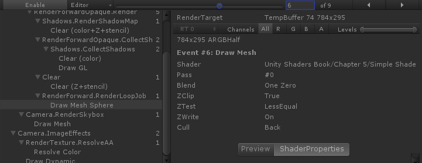

# 第5章 Unity Shader 学习之旅

## 5.2 一个最简单的顶点/片元着色器  

* 基本结构如下代码  
      
    `#pragma vertex name` 这句话告诉unity，name是顶点着色器，一般使用vert
    `#pragma fragment name` 这句话告诉unity，name是片元着色器，一般使用frag。  
    vert函数定义

    ```c
    float4 vert(float4 v:POSITION) : SV_POSITION{
        return mul(UNITY_MATRIX_MVP, v)
    }
    ```

    参数中的POSITION是一种语义，告诉unity，把模型的顶点坐标赋给参数v。
    SV_PISITION也是中语义，告诉unity，顶点着色器的输出是是剪裁空间中的顶点坐标。

    ```c
    float4 frag() : SV_Target{
        return fixed4(1.0, 1.0, 1.0, 1.0);
    }
    ```

    片元函数没有任何输入，SV_Target告诉unity，把输出结果存储到一个渲染目标中，这里将输出到默认的帧缓存中。其返回的fixed4类型中每个颜色范围为[0，1]  

* 模型数据从哪里来  

    上面的例子中，我们使用POSITION得到了模型的顶点位置，那么我们如何得到更多的信息呢？  

    现在我们想要得到模型上的每个顶点的纹理坐标和法线方向。我们需要给一个新的输入类型，这个类型不是简单的数据类型，而是一个结构体。  

    ```c
    struct Name {
        Type name : Semantic;
    };

    // a2v 表示application to vertex
    // v2f 表示vertex to fragment
    struct a2v {
        float4 vertex : POSITION;
        float3 normal : NORMAL;
        float4 texcoord : TEXCOORD0;
    };

    ```

    上面的代码中POSITION，NORMAL，以及可能的TARGENT都是使用该材质的实体的Mesh Render组件提供的。在每一帧调用Draw Call的时候，Mesh Render组件会把它负责的模型的数据发送给Unity Shader。  
    我们知道，每一个模型包含了一组三角面，每个三角面由三个顶点构成。而每个顶点又包含了一些其他数据。例如：顶点位置，法线，切线，纹理坐标，顶点颜色。二通过上面的方法我们就可以在顶点着色器中获取顶点的这些数据。  

* 顶点着色器和片元着色器怎么通信。  
    我们需要定义新的结构体，并将其作为片元着色器的输入类型。  

    ```cs
    struct v2f {
        float4 pos : SV_POSITION;
        fixed3 color : COLOR0;
    };

    // 使用新的结构体类型作为参数类型
    fixed4 frag(v2f i) : SV_Target {
        fixed3 c = i.color;
        c *= _Color.rgb;
        return fixed4(c, 1.0);
    }
    ```

    COLOR0语义中的数据可以由用户自定义，但一般都是存储颜色。类似的语义还有COLOR1等。  

    注意，顶点着色器是逐顶点调用，片元着色器是逐片元调用。片元着色器的输入，实际上是把顶点着色器的输出插值后得到的结果。  

* 如何使用属性  
    现在我们有了新的需求，我们需要在材质面板上显示一个颜色拾取器。我们需要使用到Properties语义块中。  

    ```cs
    Shader "Unity Shaders Book/Chapter 5/Simple Shader" {
        Properties {
            _Color ("Color Tint", Color) = (1, 1, 1, 1)
        }
        SubShader {
            Pass {
                CGPROGRAM
                ...
                uniform fixed4 _Color;
                ...
                fixed4 frag(v2f i) : SV_Target {
                    fixed3 c = i.color;
                    c *= _Color.rgb;
                    return fixed4(c, 1.0);
                }

                ENDCG
            }
        }
    }
    ```

    在CG代码中，我们需要定义一个与Properties中属性名称和类型完全相同的类型。  
    在shader中显示如下  
      
    在使用该shader的材质中的显示  
      

## 5.3 unity提供的内置文件和变量  

* 举例包含UnityCG文件
    这些文件的后缀都是cginc

    ```cs
    CGPROGRAM
    ...
    #include "UnityCG.cginc"
    ...
    ENDCG
    ```

    官网上可以获取这些文件。  
    常用包含文件  
      
    有些文件即使我们没有包含，但也会自动包含进去。
    Unity.cginc中常用的结构体
      
    务必学习上述表中的结构体的声明。  
    下面是常用的帮助函数  
      
    建议在文件中找到这些函数并尝试理解他们。  

## 5.4 Unity提供的CG/HLSL语义  

* 什么是语义
    SV_POSITION，POSITION，COLOR0。  
    这些语义可以让Shader知道从哪里读取数据，并把数据输出到哪里。但是Unity并没有支持所有的语义。  
    语义在不同的位置有不同的含义。  
    例如TEXCOORD0，既可以放在a2f，也可以房子f2v中。在a2f中TEXCOORD0有特别含义，即把模型的第一组纹理坐标存储在该变量中。而在f2v中，其含义则由我们定义了。  
    为了更好的跨平台性，最好使用SV开头的语义。  
* Unity支持的语义  
    1. 从应用阶段给顶点着色器传递模型数据时常用的语义  
        语义|解释
        -|:-:|:-:
        POSITION|模型空间中的顶点位置通常是float4类型
        NORMAL|顶点法线
        TANGENT|顶点切线
        TEXCOORDn|该顶点的纹理坐标，n表示是第几个通常是float2或float4
        COLOR|顶点颜色，通常是fixed4或float4
    2. 从顶点着色器到片元着色器Unity常用语义
        语义|解释
        -|:-:|:-:
        SV_POSITION|剪裁空间中的顶点坐标，结构体中必须包含一个用该语义修饰的变量。
        COLOR0|通常用于输出第一组顶点颜色，但不是必需的
        COLOR1|通常用于输出第二组顶点颜色，但不是必需的
        TEXCOORD0~TEXCOORD7|通常用于输出纹理坐标，但不是必须的
    3. 片元着色器输出到Unity时常用语义
        语义|解释
        -|:-:|:-:
        SV_Target|输出值将会存储到渲染目标中，等同于DirectX9中的COLOR，但最好使用SV_Target
* 定义复杂的数据类型

    ```cs
    struct a2v {
        float4 vertex : POSITION;
        float3 normal : NORMAL;
        float4 texcoord : TEXCOORD0;
    };
    ```

## 5.5 Debug  

* vs下的 Graphics Debugger
* 帧调试器 Frame Debugger (Windows/Analysis/Frame Debugger)
    帧调试器可以查看渲染当前帧时进行的各种渲染事件，这些事件包括了DrawCall序列，也包括了类似清空帧缓存等操作。  
      
    1. 滑动块
        滑动块可以快速遍历当前帧的每一个事件
    2. 左界面
        展示了渲染当前帧的所有事件
    3. 右界面
        当前选中事件的详细信息  

## 5.x 平台差异
