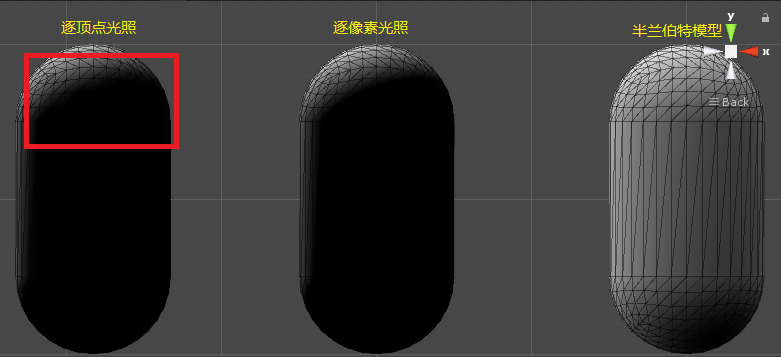

# Unity中的基础光照

渲染总是围绕一个基础问题：我们如何决定一个像素的颜色？从宏观上说，渲染包含了两大部分。决定一个像素的可见性，决定这个像素山的光照计算。而光照模型就是用与决定一个像素上进行怎样的光照。  

## 6.1 我们时如何看到这个世界的  

为了区分两种不同的散射，我们在光照模型中使用了不同的部分来计算他们：高光反射部分表示物体表面是如何反射光线的。漫反射部分表示有多少光线会被折射，吸收和散射出表面。  

1. 辐照度：对于垂直照射的光来说，是单位时间事件内穿过单位平面的能量。对于倾斜照射的光来说，则是垂直分量的辐照度。所以总的来说，辐照度=单位法线·光照。  
2. 出射度：根据入射光线的数量和方向，我们可以计算出射光线的方向和数量，我们用出射度来描述它。  
3. 着色：更具材质属性（如漫反射属性）和光源信息（光源方向，辐照度等），使用一个等式去计算某一个方向上的出射度的过程。我们也把这个等式称为光照模型。不同的光照模型有不同的目的，比如一些用于描述粗糙表面，有些用于描述金属表面。  
4. BRDF：双向反射分布函数（bidirectional reflectance distribution function、BRDF）是用来定义给定入射方向上的辐照度如何影响给的出方向上的辐射率。  

## 6.2 标准光照模型  

1. 标准光照模型值关心直接光照，也就是直接从光源发射出来照射到物体的表面后，经过物体表面一次反射直接进入摄像机的光线。它的基本方法是把光照分为四个部分，每个部分用一种方法来计算它的贡献度。这四个部分分别是：  
    * 自发光部分：（missive）这个部分描述当给定一个方向时，物体本身会向该方向发射多少辐射量。注意，如果没有使用全局光照，这些光则不会照亮周围的物体，而仅仅是使自己看起来更亮。
    * 高光反射部分：（specular）这个部分描述光线照射到模型表面时，该表面会在完全镜面反射的方向散射多少辐射量。
    * 漫反射：（diffuse）这个部分表示光线照射到模型表面时，该表面会向每个方向散射都少辐射量。
    * 环境光：（ambient）这个部分描述其他所有间接光照。
2. 环境光  
    环境光的计算非常简单，通常是一个全局常量。  
3. 自发光  
    环境光的计算非常简单，就是直接使用了该材质的自发光颜色。  
4. 漫反射  
    漫反射中视角的位置不重要，因为反射是完全随机的。  
    漫反射光照符合兰伯特定律，反射光线的强度与表面法线和光源方向之间夹角的余弦成正比。计算方式如下：  
      
    其中n是表面法线，I是指向光源的单位向量，Clight是光源颜色，Mdiffuse是材质的漫反射颜色。需要注意的是我们需要防止法线和光源方向点乘结果为负，为此我们截取到0，这可以防止物体被从后面照射的光照亮。  
5. 高光反射  
    这里的高光反射是经验模型，也就是说它并不符合真实世界中的高光反射现象。它可以计算那些沿着完全镜面反射方向反射的光线。这可以让物体看起来由光泽，如金属表面。  
    计算高光反射需要知道的信息比较多，如表面法线，光源方向，视角方向，反射方向等。我们假设这些矢量都是单位矢量。这四个矢量中我们知道三个就行了，反射方向可以按照下公式计算：  
      
    带入Phone模型计算  
      
    Mgloss是材质的光泽度，它控制高光区域的大小，其越大，两点越小。Mspscular是材质的高光反射颜色，Clight则是光源的颜色和强度。  
    和上述的公式相比，Blinn提供了一个简单的修改方式达到类似效果。它的基本思想是避免反射计算，为此Blinn模型引入新的矢量：  
      
    带入模型公式如下：  
      
      
    当摄像机和光源举例模型足够远时，Blinn模型会快于Phone模式。  
6. 逐像素还是逐顶点
    计算光照模型通常有两种选择：在片元着色器中计算，也被称为逐像素光照。或者在顶点着色器中计算，也被称为逐顶点光照。
    在逐像素光照中，我们以每个像素为单位，得到其法线（可以时通过顶点法线插值，也可以是从纹理法线采样得到），然后进行光照模型计算。  
    在逐顶点光照中，我们会为每一个顶点计算光照，然后在每个图元内部进行插值计算，最后输出为像素颜色。一般说顶点数量小于像素数量，所以逐顶点光照往往计算量比逐像素光照小。但是由于逐顶点光照依赖线性插值，所以在有非线性计算时会出现问题（如计算高光反射），此时会出现问题。而且由于逐顶点关照会在图元内部进行线性插值，这会导致图元内部的颜色总是暗于顶点，这在一些情况下会产生棱角现象。  
    上述的光照属于标准光照模型，后面我们会学习基于物理的光照模型，其更真实也更复杂。  

## Unity中的环境光和自发光  

Unity环境光设置：Windows-Render-Lighting，在Unity Shader中环境光通过内置变量UNITY_LIGHTMODEL_AMBIENT获得。  

## 在Unity Shader中实现漫反射光照模型  

我们来实现标准光照模型中的漫反射光照部分。  
漫反射公式：  
  
在Unity中我们使用函数saturate来限制参数在[0，1]的范围内。（如果参数是一个矢量，那么会对它的每一个分量进行这样的操作。）  

1. 逐顶点光照  

    ```cs
    Shader "Custom/C6/DiffuseVertexShader"
    {
        Properties{
            // 材质的漫反射颜色
            _Diffuse ("漫反射", Color) = (1,1,1,1)
        }
        SubShader{
            pass{
                Tags{"LightMode"="ForwardBase" }

                CGPROGRAM

                #pragma vertex vert
                #pragma fragment frag

                #include "Lighting.cginc"

                fixed4 _Diffuse;

                struct a2v{
                    float4 vertex : POSITION;
                    float3 normal : NORMAL;
                };

                struct v2f{
                    float4 pos : SV_POSITION;
                    float3 color : COLOR;
                };

                v2f vert(a2v v){
                    v2f o;
                    o.pos = UnityObjectToClipPos(v.vertex);
                    // o.color = fixed3(1,1,1);
                    // 环境光
                    fixed3 ambient = UNITY_LIGHTMODEL_AMBIENT.xyz;

                    // 世界坐标中的模型的顶点法线
                    fixed3 worldNormal = normalize(mul(v.normal, (float3x3)unity_WorldToObject));

                    // 光源的方向
                    fixed3 worldLightDir = normalize(_WorldSpaceLightPos0.xyz);

                    // 光源颜色*材质的漫反射颜色*max(1,dot(顶点法线, 光源方向))
                    fixed3 diffuse = _LightColor0.rgb * _Diffuse.rgb * saturate(dot(worldNormal, worldLightDir));

                    o.color = diffuse;

                    return o;
                }
                // SV_Target (SV system value ):表示输出结果将保存在渲染目标中
                fixed4 frag(v2f i) : SV_TARGET{
                    return fixed4(i.color, 1);
                }

                ENDCG
            }
        }
        FallBack "Diffuse"
    }

    ```

2. 逐像素光照

    ```cs
        Shader "Custom/C6//DiffuseFragmentShader"
        {
            Properties{
                // 材质的漫反射颜色
                _Diffuse ("漫反射", Color) = (1,1,1,1)
            }
            SubShader{
                pass{
                    Tags{"LightMode"="ForwardBase" }

                    CGPROGRAM

                    #pragma vertex vert
                    #pragma fragment frag

                    #include "Lighting.cginc"

                    fixed4 _Diffuse;

                    struct a2v{
                        float4 vertex : POSITION;
                        float3 normal : NORMAL;
                    };

                    struct v2f{
                        float4 pos : SV_POSITION;
                        float3 worldNormal : TEXCOORD0;
                    };

                    v2f vert(a2v v){
                        v2f o;
                        o.pos = UnityObjectToClipPos(v.vertex);

                        o.worldNormal = mul(v.normal, (float3x3)unity_WorldToObject);
                        return o;
                    }
                    // 片元着色器中 片元着色器的输入是对顶点信息插值后的结果
                    fixed4 frag(v2f i) : SV_TARGET{
                        // 环境光
                        fixed3 ambient = UNITY_LIGHTMODEL_AMBIENT.xyz;

                        // 世界坐标中的模型的顶点法线
                        fixed3 worldNormal = i.worldNormal;

                        // 光源的方向
                        fixed3 worldLightDir = normalize(_WorldSpaceLightPos0.xyz);

                        // 光源颜色*材质的漫反射颜色*max(1,dot(顶点法线, 光源方向))
                        fixed3 diffuse = _LightColor0.rgb * _Diffuse.rgb * saturate(dot(worldNormal, worldLightDir));

                        float3 color = diffuse + ambient;

                        return fixed4(color, 1.0);
                    }

                    ENDCG
                }
            }
            FallBack "Diffuse"
        }

    ```

    > LYN 片元着色函数由片元着色器执行，位于渲染流程的光栅化阶段（三角形设置-三角形遍历-片元着色器-逐片元操作）。在三角形设置和三角形遍历后，我们获得了片元序列，也就是说，每个三角形有很多片元。所以一个图元会调用很多次片元着色器，每一次的输入则是对顶点数据插值得到的。所以再逐像素光照中（片元着色器执行）没有逐顶点操作的“不规则”的阴影边界。也因为逐顶点光照只计算了顶点颜色，图元内部或者说每个片元的颜色是插值的结果。  

3. 半兰伯特模型  
    兰伯特定律：在平面上一点的漫反射光的光强与该点的法向量和入射光角度的余弦值成正比。在兰伯特模型上进行小的更改：
      
    通常α和β的数值为0.5  
      
    这里只写出与逐像素光照不同的一段代码  

    ```cs
    fixed3 diffuse = _LightColor0.rgb * _Diffuse.rgb * (0.5*dot(worldNormal, worldLightDir) + 0.5);
    ```

    下图是三种模型在同一个光照下的效果图，逐顶点光照有明显的图元颜色“锯齿”。  
      

## 6.5 在Unity中实现高光反射模型  

高光反射计算公式如下
  
反射角度计算  
  
CG提供了计算反射方向的函数：  
`reflect(i, n) // i入射方向， n法线方向`

1. 实现逐顶点光照  

    ```cs
    Shader "Custom/6_5/VertLighting"{
        Properties{
            _Diffuse ("漫反射颜色", Color) = (1,1,1,1)
            _Specular ("高光反射颜色", Color) = (1,1,1,1)
            // 数值越小，光斑越大
            _Gloss ("光泽度", Range(8.0, 256)) = 20
        }
        SubShader{
            Pass{
                Tags { "LightMode"="ForwardBase" }

                CGPROGRAM

                #pragma vertex vert
                #pragma fragment frag

                #include "Lighting.cginc"

                fixed4 _Diffuse;
                fixed4 _Specular;
                float _Gloss;

                struct a2v{
                    float4 vertex : POSITION;
                    float3 normal : NORMAL;  
                };

                struct v2f{
                    float4 pos : SV_POSITION;//????SV_POSITION
                    fixed3 color : COLOR;//???COLOR0
                };

                v2f vert(a2v v){
                    v2f o;
                    // 转换到齐次剪裁空间
                    o.pos = UnityObjectToClipPos(v.vertex);

                    // 获取环境光
                    fixed3 ambient = UNITY_LIGHTMODEL_AMBIENT.xyz;

                    // 把顶点的法向量从模型坐标系转换到世界坐标系
                    fixed3 worldNormal = UnityObjectToWorldNormal(v.normal);
                    // 光照方向
                    fixed3 worldLightDir = normalize(_WorldSpaceLightPos0.xyz);

                    // 获得漫反射
                    fixed3 diffuse = _LightColor0.rgb * _Diffuse.rgb * saturate(dot(worldNormal, worldLightDir));

                    // 获得反射方向
                    fixed3 reflectDir = normalize(reflect(-worldLightDir, worldNormal));
                    // 获得观察方向
                    // fixed3 viewDir = normalize(_WorldSpaceCameraPos.xyz - mul(unity_ObjectToWorld, v.vertex).xyz);
                    fixed3 viewDir = normalize(WorldSpaceViewDir(v.vertex));

                    // 获得高光反射
                    fixed3 specular = _LightColor0.rgb * _Specular.rgb * pow(saturate(dot(reflectDir, viewDir)), _Gloss);

                    o.color = ambient + diffuse + specular;

                    return o;
                }

                fixed4 frag(v2f i) : SV_Target{
                    return fixed4(i.color, 1.0);
                }

                ENDCG
            }
        }
        FallBack "Diffuse"
    }
    ```

2. 实现逐像素光照  

    ```cs
    // 参照下面的代码，基本相同
    ```

3. BlinnPhone模型的光照

    ```c++
    Shader "Custom/6_5/BlinnPhongLighting"{
        Properties{
            _Diffuse ("漫反射颜色", Color) = (1,1,1,1)
            _Specular ("高光反射颜色", Color) = (1,1,1,1)
            // 数值越小，光斑越大
            _Gloss ("光泽度", Range(8.0, 256)) = 20
        }
        SubShader{
            Pass{
                Tags { "LightMode"="ForwardBase" }

                CGPROGRAM
                #pragma vertex vert
                #pragma fragment frag

                #include "Lighting.cginc"

                fixed4 _Diffuse;
                fixed4 _Specular;
                float _Gloss;

                struct a2v{
                    float4 vertex : POSITION;
                    float3 normal : NORMAL;
                };

                struct v2f{
                    float4 pos : SV_POSITION;// 剪裁空间中的顶点坐标，必须有一个该语义修饰的变量
                    float3 normal : TEXCOORD0;
                    float4 worldPos : TEXCOORD1;
                };

                v2f vert(a2v v){
                    v2f o;
                    // 转换到齐次剪裁空间
                    o.pos = UnityObjectToClipPos(v.vertex);

                    // 把顶点的法向量从模型坐标系转换到世界坐标系
                    o.normal = UnityObjectToWorldNormal(v.normal);

                    o.worldPos = UnityObjectToClipPos(v.vertex);
                    return o;
                }

                fixed4 frag(v2f i) : SV_Target{
                    // 获取环境光
                    fixed3 ambient = UNITY_LIGHTMODEL_AMBIENT.xyz;

                    // 光照方向
                    fixed3 worldLightDir = normalize(_WorldSpaceLightPos0.xyz);

                    // 获得漫反射
                    fixed3 diffuse = _LightColor0.rgb * _Diffuse.rgb * saturate(dot(i.normal, worldLightDir));

                    // 获得反射方向
                    fixed3 reflectDir = normalize(reflect(-worldLightDir, i.normal));
                    // 获得观察方向
                    // fixed3 viewDir = normalize(WorldSpaceViewDir(i.worldPos)); //逐像素光照使用这一句
                    fixed3 halfDir = normalize(worldLightDir + reflectDir); //BlinnPhong模型
                    // 获得高光反射
                    // fixed3 specular = _LightColor0.rgb * _Specular.rgb * pow(saturate(dot(reflectDir, viewDir)), _Gloss); //逐像素光照
                    fixed3 specular = _LightColor0.rgb * _Specular.rgb * pow(max(0, dot(reflectDir, halfDir)), _Gloss); //BlinnPhong模型

                    return fixed4(ambient + diffuse + specular, 1.0);
                }

                ENDCG
            }
        }
        FallBack "Diffuse"
    }

    ```