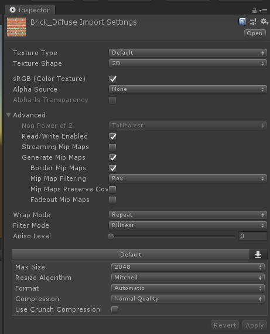
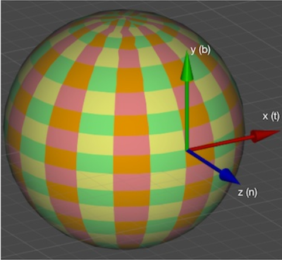

# 第七章 基础纹理

纹理最初的目的是用一张图片来控制模型的外观，通过`纹理映射技术`，我们可以把一张图片“黏”在模型表面，`逐纹素`（为例区别于像素）地控制模型表面的颜色。  

在建模的时候，通常会在建模软件中利用`纹理展开技术`把`纹理映射坐标`存储在每个顶点上。纹理映射坐标定义了该顶点在纹理中对应的2D坐标。通常使用一个二维变量（u,v）表示，u指横坐标，v指纵坐标。因此纹理映射坐标也称`UV`坐标。  

顶点UV坐标通常被归一化到[0,1]范围内。

## 7.1 单张纹理  

* 下面的代码的反射使用了一张简单纹理进行光照计算  

    ```cpp
    Shader "Custom/7_1/Signal Texture"{
        Properties{
            _Color ("Color Tint", Color) = (1,1,1,1)
            _MainTex ("Main Tex", 2D) = "white" {}
            _Specular ("Specular", Color) = (1,1,1,1)
            _Gloss ("Gloss", Range(8.0, 255)) = 20
        }

        SubShader {
            pass{
                Tags { "LightMode"="ForwardBase" }
                CGPROGRAM

                #pragma vertex vert
                #pragma fragment frag
                #include "Lighting.cginc"

                float4 _Color;
                sampler2D _MainTex;
                // 用于调节纹理的缩放scale和偏移translation  名称必需时Name_ST格式
                // _MainTex_ST 的属性xy是偏移， zw是缩放。
                float4 _MainTex_ST;
                float4 _Specular;
                float _Gloss;

                struct a2v {
                    float4 pos : POSITION;
                    float3 normal : NORMAL;
                    float4 texcoord : TEXCOORD0; // 这里到底是啥？
                };

                struct v2f {
                    float4 pos : SV_POSITION;
                    float3 worldNormal : TEXCOORD0;
                    float3 worldPos : TEXCOORD1;
                    float2 uv : TEXCOORD3;
                };

                v2f vert (a2v i) {
                    v2f o;
                    o.pos = UnityObjectToClipPos(i.pos);
                    o.worldNormal = UnityObjectToWorldNormal(i.normal);
                    o.worldPos = UnityObjectToClipPos(i.pos);
                    // o.uv = i.texcoord.xy * _MainTex_ST.xy + _MainTex_ST.zw;
                    o.uv = TRANSFORM_TEX(i.texcoord, _MainTex); //内部实现用到了ST，但是这里传值用纹理名。其内部实现就是上面注释掉的代码

                    return o;
                }

                // 在这里我们要在片元着色器中计算漫反射时使用纹理的纹素值
                fixed4 frag (v2f ii) : SV_Target {
                    fixed3 worldNormal = normalize(ii.worldNormal);
                    fixed3 worldLightDir = normalize(UnityWorldSpaceLightDir(ii.worldPos));
                    // 采集纹理中uv坐标上的纹素属性，并获取该纹素的颜色；
                    fixed3 albedo = tex2D(_MainTex, ii.uv).rgb * _Color.rgb;
                    fixed3 ambient = UNITY_LIGHTMODEL_AMBIENT.xyz * albedo;

                    fixed3 diffuse = _LightColor0.rgb * albedo * max(0, dot(worldNormal, worldLightDir));

                    fixed3 viewDir = normalize(UnityWorldSpaceViewDir(ii.worldPos));
                    fixed3 halfDir = normalize(worldLightDir + viewDir);
                    fixed3 specular = _LightColor0.rgb * _Specular.rgb * pow(max(0, dot(worldNormal, halfDir)), _Gloss);

                    return fixed4(diffuse+specular+ambient, 1.0);
                }

                ENDCG
            }
        }
        Fallback "Specular"
    }
    ```

* 纹理的属性  

      
    属性Warp Mode：当纹理坐标超过[0,1]范围时，平铺的方式。  
    属性Filter Mode：当纹理变换而产生拉伸时，采取何种滤波模式。Point，Bilinear，Trilinear。效果依次提升，性能耗费也提升。  
    纹理缩小过程比放大复杂，原因在于处理抗锯齿问题。一个最常用的方法是采用`多级渐远纹理`技术。该技术将原纹理预先通过滤波技术处理得到多个更小的图像。形成了一个图像金字塔，每一层都是对上一层的采样。这样在实时运行时就可以快速得到像素。例如当物体原理相机时，直接使用小的纹理。但是会多使用1/3的内存。在Avanced下面的Generate Mip Maps 选项打开就可以使用多级渐远纹理技术了。  
    超过最大尺寸的纹理将会被缩放。纹理尺寸最好是2的整数次方。  

## 7.2 凹凸映射

`凹凸映射`：用一张纹理来修改模型表面的法线。这种方式并不会让模型真的凹凸不平，而只是看起来。但是可以从模型的轮廓处看出“破绽”。  

* 法线纹理  
    由于法线只有方向，放在模型坐标中或者在切线坐标系中的两种情况分别为模型空间的法线纹理，切线空间的法线纹理。下图是切线空间坐标系：  
      
    由于颜色范围在0-1，而法线范围在-1到1，所以需要公式映射：（法线+1）/ 2即得到法线纹理中的数值。可以看出，切线坐标系中的法线纹理，偏蓝色。这是因为，如果一个点的法线方向不变（即法线纹理保存的凹凸映射值和模型相同），那么它的法线在切线坐标系中就表示为（0，0，1），那么它存储在纹理中的RGB值就是（0.5，0.5，1），这就是浅蓝色。  

```cs
Shader "Custom/7_1/NormalMapInTangentSpace" {
    Properties {
        _Color ("Color", Color) = (1,1,1,1)
        _MainTex ("Main Tex", 2D) = "white" {}
        _BumpMap ("Noraml Map", 2D) =   "bump" {}
        _BumpMapScale ("Bump Map Scale", float) = 1.0 // 描述凹凸程度
        _Specular ("Specular", Color) = (1,1,1,1)
        _Gloss ("Gloss", Range(8.0, 256)) = 20 
    }

    SubShader { 
        pass {
            Tags { "LightMode" = "ForwardBase" }

            CGPROGRAM
            #pragma vertex vert
            #pragma fragment frag

            #pragma enable_d3d11_debug_symbols
            #include "Lighting.cginc"

            fixed4 _Color ;
            sampler2D _MainTex;
            float4 _MainTex_ST;
            sampler2D _BumpMap;
            float4 _BumpMap_ST;
            float _BumpMapScale; 
            fixed4 _Specular ;
            float _Gloss ;


            struct a2v {
                fixed4 vertex : POSITION;
                float3 normal : NORMAL;
                float4 tangent : TANGENT; //切线不同于法线，我们需要w分量来确定副切线方向，所以是四维
                float4 texcoord : TEXCOORD0;
            };

            struct v2f {
                float4 pos : POSITION;
                float2 uv : TEXCOORD0;
                float3 lightDir : TEXCOORD1;
                float3 viewDir : TEXCOORD2;
                float2 normalMapUV : TEXCOORD3;
            };

            v2f vert (a2v v){
                v2f o; 
                // 获取剪裁空间顶点位置
                o.pos = UnityObjectToClipPos(v.vertex);
                // 纹理uv坐标
                o.uv = TRANSFORM_TEX(v.texcoord, _MainTex);
                // 法线贴图uv坐标
                o.normalMapUV = TRANSFORM_TEX(v.texcoord, _BumpMap);
                // 构造了一个3x3举证rotation，从模型空间转换到切线空间
                TANGENT_SPACE_ROTATION;
                o.lightDir = mul(rotation, ObjSpaceLightDir(v.vertex)).xyz;
                o.viewDir = mul(rotation, ObjSpaceViewDir(v.vertex)).xyz;

                return o;
            }

            fixed4 frag (v2f ii) : SV_Target{
                // 归一化方向矢量
                float3 tangentLightDir = normalize(ii.lightDir);
                float3 tangentViewDir = normalize(ii.viewDir);

                // 取得法向贴图的片元法向量，该法向量需要从【1，0】范围转换到【-1，1】的范围
                fixed4 packedNormal = tex2D(_BumpMap, ii.normalMapUV);
                // 解包法向量的映射
                fixed3 tangentNormal = UnpackNormal(packedNormal);
                // 乘以凹凸程度系数
                tangentNormal.xy *= _BumpMapScale;
                tangentNormal.z = sqrt(1.0 - saturate(dot(tangentNormal.xy, tangentNormal.xy)));


                // 反射系数
                fixed3 albedo = tex2D(_MainTex, ii.uv).rgb * _Color.rgb;
                // 环境光
                fixed3 ambient = UNITY_LIGHTMODEL_AMBIENT.xyz * albedo;

                // 漫反射
                fixed3 diffuse = _LightColor0.rgb * albedo * max(0, dot(tangentNormal, tangentLightDir));

                // 获取反射角
                fixed3 halfDir = normalize(tangentLightDir + tangentViewDir);
                // 高光反射
                fixed3 specular = _LightColor0.rgb * _Specular.rgb * pow(max(0, dot(tangentNormal, halfDir)), _Gloss);

                // return fixed4(specular + diffuse + ambient, 1.0);
                return fixed4(specular + diffuse + ambient, 1.0);
            }

            ENDCG
        }
    }
    Fallback "Specular"
}
```

