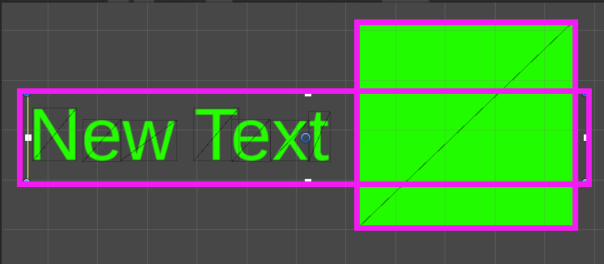

# UGUI的draw call合并原理

[参考这篇博客（Unity2017.3）](https://blog.csdn.net/akak2010110/article/details/80953370)

## 概念篇

* bottomUI（和材质纹理无关）
  底层对象是上层对象的bottomUI需要满足以下条件（单条是必要条件，3条合并才是充分条件）
  1. 底层对象和上层对象构成的矩形有相交。（不是说RectTranfrom相交，下面会说）
  2. Hierarchy视图中底层对象在上层对象上面，也就是底层.siblingIndex < 上层.siblingIndex。
  3. 如果上层对象中有多个UI满足1和2条件，则上层对象的bottomUI应取siblingIndex差值的绝对值最小的那个。
  
  
  上图中，虽然text和image（紫色为RectTransform范围）有重合，但是并不是三角面相交，所以并不复合1条件。

* 合批
  两个UI空间的材质球的instanceid（材质球的instanceid和纹理）相同，那么这两个UI才可能合并。

* depth
  depth是UGUI渲染排序的第一参考值，下图展示了获得过程：利用深度遍历每一个节点，检测是否能和bottomUI合并，能合并则设置depth为bottomUI的depth，否则设为bottomUI.depth+1。对于没有bottomUI的则设置depth为0；  
  深度优先遍历，就是Hierarchy视图全部展开时UI的排序。  

## 排序和计算dc

我们得到每个UI节点depth后，会对每个节点进行排序，排序规则（如：当前1规则无法区分先后，则使用2），按优先顺序有：

1. 按照depth排序。
2. 如果1无法区分，按照材质球ID升序。
3. 如果2无法区分，按照纹理ID降序。
4. 如果3无法区分，按siblingIndex升序排序。

最后开始合批，对于`depth相等`且`连续相邻UI`进行合批。（depth可能不需要检测）  

## 一个可能的错误-LYN

其实我有点怀疑最后合批是否还要检测depth，因为在一个案例中，ABC的depth为001，也就是B是C的bottomUI，但是纹理不同，所以C的depth为1。在得到depth后，开始排序，鉴于第一个和第二个都是depth=0，比较他们的纹理ID，使得它们交换位置，最后得到的顺序是BAC，A和C的depth不同，但是纹理材质都相同，满足合批条件，最后会合批。这里，depth没有被设为合批前置条件。再回到前面比较纹理ID，如果他们比较纹理后不交换位置，则不会合批，这时合批被打断了。
