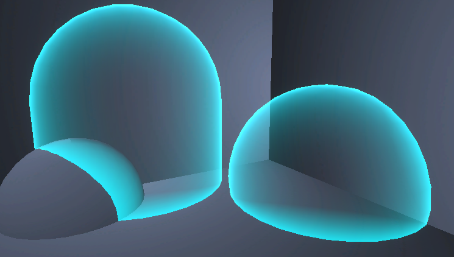

# 护盾 相交检测
## 基础护盾
* 基本原理1：SceneDepth取值于非透明渲染之前，而ScreenPosition.z取值所有对象渲染完成后，故求其差值，越小代表非透明对象和透明对象越接近，从而求得交接
* 基本原理2：菲涅尔杰点获取3D描边效果，和相交结果合并，取得渲染区域。
* 注意：发光区域最好和渲染区域相乘，否则光照导致透明区域不明显。
* 注意：两个区域的合并可以通过调整参数，观察到一样大就差不多了。

