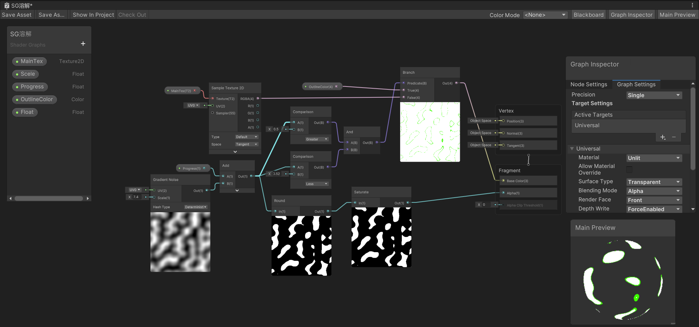
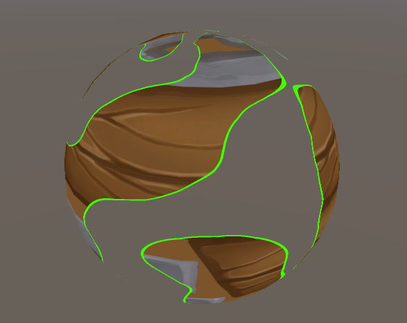

# 溶解类
## 溶解消失和生成
* 基本原理：噪波纹理设定clip方法的阈值。
* 溶解边界：当采样噪波值在（0.5，0.51）时输出边界颜色。（round的使用，使得边界的值其实为噪波采样0.5时的位置）
* 注意：必须使用透明队列，否则alpha设置无效，透明后背部其他物体依然无法显示。
* 注意：必须写入深度，以免透明区域显示本物体背部。
* 注意：使用round方法可以锐化渐变噪波纹理。

## 换装
* 对大于设定值（0-1）的纹理采用服装1，对小于设定值的纹理采用服装2
