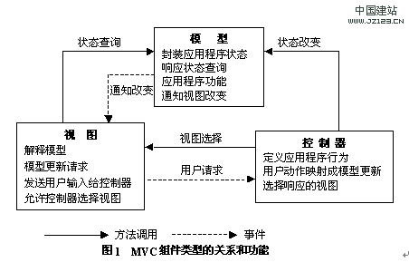

# MVC

* 概念
  模型-视图-控制器的缩写，一种软件设计典范，用一种业务逻辑，数据，界面显示分离的方法组织代码，将业务逻辑聚集到一个部件里，在改进和个性化定制界面及用户交互时，不需要重写业务逻辑。  
  `模型`：处理数据逻辑。不仅仅是数据，可以称之为功能，也可以认为是除了显示和胶水代码以外的全部。  
  `视图`：处理数据显示。不仅仅包括界面布局，外观设置，文本信息外，只针对以上内容的逻辑也包含在内。  
  `控制器`：处理交互部分。胶水代码，只负责调用和view和model的具体逻辑，自生几乎没有代码量。  

    
  总结上图逻辑：  
  1. 控制器：  
    定义应用程序行为：其他的  
    用户动作行为映射成模型更新：比如视图通知控制器增加经验，控制器则把经验转换成等级增加和等级修改，就需要控制器判断。  
    选择响应视图：点击按钮后修改按钮图片。（如果不使用Unity自带功能）  
  2. 模型：  
    封装应用程序状态：
    响应状态查询：如视图需要获取当前等级。  
    应用程序功能：？？？  
    通知视图改变：当控制器修改了数据后，需要通知视图修改显示内容。（可以使用事件，视图注册模型数据修改的事件。）  
  3. 视图：  
    解释模型：查询到经验状态时（包含当前和升级需要）则把多个结果设置到UI上。　　
    模型更新请求：  
    发送用户输入给控制器：点击，鼠标移动等。  
    允许控制器修改视图：提供共有属性或函数使得控制器可以调用，从而修改视图。  

  总结上图调用和事件：  
  1. 控制器-视图选择：如控制器判断界面需要显示UI。  
  2. 控制器-状态改变：如等级改变，则修改模型中的数值。  
  3. 视图-用户请求：玩家
  4. 模型通知改变：调用视图注册在模型中事件，实现视图修改。

  优点
  * 低耦合  
  数据层和业务层的分离，这使得单独改视图层代码而不用重新编译模型和控制器代码。
  * 重用性高
  * 易于维护：逻辑分离，使得视图问题和逻辑问题分离，定位问题更容易。

> 参考博客  
> [2020年5月31日](https://zhuanlan.zhihu.com/p/99443196)  
> 