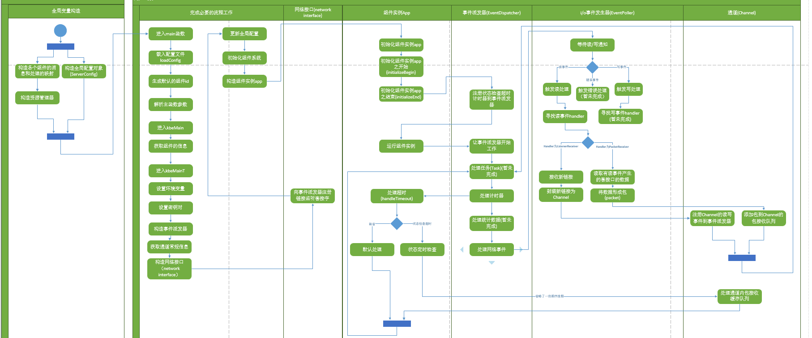

# kbengine源代码读

## 序言

本文内容学习自该帖子的内容 [地址](https://bbs.comblockengine.com/forum.php?mod=viewthread&tid=247&extra=page%3D3)，这是kbengine活动图的第一个文件。  

## 阅读

下面是主流程图


阅读本文档之前首先确保看完了kbe官网的现有文档。
> kbe由几个组件共同协作，所以这里先介绍了组件们
> 各个组件被设计为独立的app，使用网络通信进行协作。从`main`函数开始。
> 看起来似乎所有的组件都有一个这样的宏(`KBENGINE_MAIN`)来包裹`main`函数  

```cpp
int KBENGINE_MAIN(int argc, char* argv[])
    {
        ENGINE_COMPONENT_INFO& info = g_kbeSrvConfig.getXXX();
        return kbeMainT<XXX>(
            argc,  
            argv,  
            YYY,  
            info.externalPorts_min,  
            info.externalPorts_max,  
            info.externalInterface,  
            0,  
            info.internalInterface);
    }
    // XXX依旧代表组件名 如baseapp
    // YYY代表 BASEAPP_TYPE等 枚举类型，定义服务器组件类别
```  

展开宏  

```cpp  
#define KBENGINE_MAIN
kbeMain(int argc, char* argv[]);
int main(int argc, char* argv[])
{
    loadConfig();
    g_componentID = genUUID64();
    parseMainCommandArgs(argc, argv);
    char dumpname[MAX_BUF] = {0};
    kbe_snprintf(dumpname, MAX_BUF, "%" PRAppID, g_componentID);
    KBEngine::exception::installCrashHandler(1, dumpname);
    int retcode = -1;
    THREAD_TRY_EXECUTION;
    retcode = kbeMain(argc, argv);
    THREAD_HANDLE_CRASH;
    return retcode;
}
int kbeMain
// lyn 这里最后一行正好的int就是前面那块代码的返回类型，各个组件都是这个宏
```

宏替换后就是这样子

```cpp
int kbeMain(int argc, char* argv[]);
int main(int argc, char* argv[])
{
    loadConfig();
    g_componentID = genUUID64();
    parseMainCommandArgs(argc, argv);
    char dumpname[MAX_BUF] = {0};
    kbe_snprintf(dumpname, MAX_BUF, "%" PRAppID, g_componentID);
    KBEngine::exception::installCrashHandler(1, dumpname);
    int retcode = -1;
    THREAD_TRY_EXECUTION;
    retcode = kbeMain(argc, argv);
    THREAD_HANDLE_CRASH;
    return retcode;
}
int kbeMain (int argc, char* argv[])
{
    ENGINE_COMPONENT_INFO& info = g_kbeSrvConfig.getXXX();
    return kbeMainT<XXX>(
        argc,  
        argv,  
        YYY,  
        info.externalPorts_min,  
        info.externalPorts_max,  
        info.externalInterface,  
        0,  
        info.internalInterface);
}
// 各个组件特化kbeMainT时传入的是自身组件名的类 如 BaseApp
```  

* 跟进上面的`main`函数里的`loadConfig`方法

```cpp
inline void loadConfig()
{
    Resmgr::getSingleton().initialize();

    // "../../res/server/kbengine_defaults.xml"
    g_kbeSrvConfig.loadConfig("server/kbengine_defaults.xml");

    // "../../../assets/res/server/kbengine.xml"
    g_kbeSrvConfig.loadConfig("server/kbengine.xml");
}
```

Resmgr时资源管理器，再`lib/resmgr.h/.cpp`中声明和定义，在`lib/FixedMessages`类中被实例化，下面介绍过程

1. 在各个进程的 `xxx_interface.cpp` 文件中有代码：

    ```cpp
    #include "loginapp_interface.h"
    #define DEFINE_IN_INTERFACE
    #define LOGINAPP
    #include "loginapp_interface.h"
    ```

    而在其 `xxx.interface.h` 中

    ```cpp
    #if defined(DEFINE_IN_INTERFACE)
    #undef KBE_LOGINAPP_INTERFACE_H
    #endif


    #ifndef KBE_LOGINAPP_INTERFACE_H
    #define KBE_LOGINAPP_INTERFACE_H

    // common include
    #if defined(LOGINAPP)
    #include "loginapp.h"
    #endif
    ```

    也就是说在源文件cpp中两次包含xxx_interface.h产生的代码不同。不同在于是否包含头文件"loginapp.h"文件。
    > 从而对xxx_interface.h内的一些变量实现了声明（第一次）和定义（第二次）。 --参考文件

    而xxx.interface.h中有使用了这样的一个宏，NETWORK_INTERFACE_DECLARE_BEGIN，我们展开这个宏：

    ```cpp
    // 定义接口域名称
    #ifndef DEFINE_IN_INTERFACE
    #define NETWORK_INTERFACE_DECLARE_BEGIN(INAME)
        namespace INAME
    {
            extern Network::MessageHandlers messageHandlers;
    #else
    #define NETWORK_INTERFACE_DECLARE_BEGIN(INAME)
        namespace INAME
    {
            Network::MessageHandlers messageHandlers(#INAME);
    #endif

    #define NETWORK_INTERFACE_DECLARE_END() }
    ```

    可以发现`DEFINE_IN_INTERFACE`是否定义，宏体不同（[宏定义](./番外篇/CPP宏定义.md)）  
    第一次带有extern，第二次不带有（[Extern关键字](./番外篇/Extern关键子.md)）  
    也就是说两次include操作，内部messageHandlers对象不是同一个。文档有说，这里第一次是声明，第二次是定义。

    之后则才有机会`Network::FixedMessages`类被有机会实例化。

