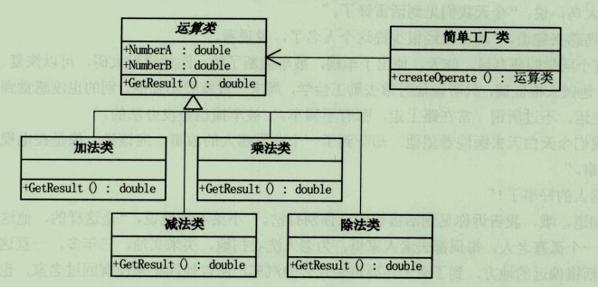
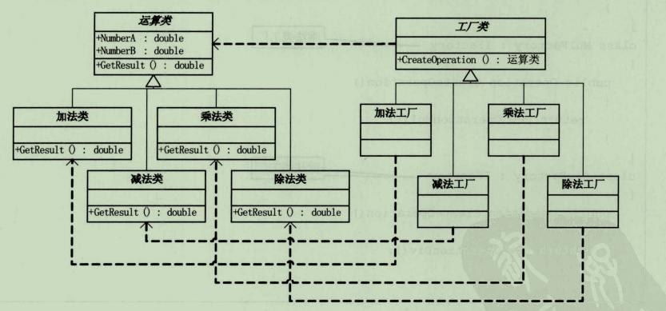
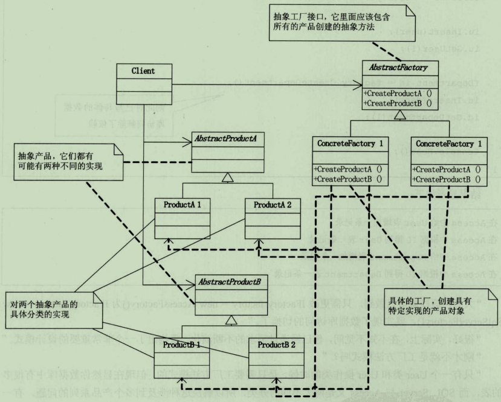

# 工厂模式

工厂模式是一种创建模式，它提供了创建对象的最佳方式。在工厂模式中，对象的创建逻辑不会暴露给客户端，而且使用统一的接口指向创建的对象。  

## 简单工厂

客户端使用工厂实例，并传递参数，用以创建所需对象。  
缺点：新增产品时，需要修改工厂。（应该尽量关闭修改，使用扩展）  

## 工厂方法

对于工厂方法模式，使得具体的创建过程延迟到子类去实现。
缺点：产品过多时，工厂类数量太多。  

## 抽象工厂模式

即创建一个抽象工厂作为所有工厂的基类，由子类实现创建方法，这样可以创建专门针对的工厂。  
比如图形编辑器可以创建图形（圆，矩形，三角性）也可以创建颜色（绿色，红色，蓝色）。则抽象一个工厂类，然后抽象连个工厂类的子类（图形工厂和颜色工厂）而每一个颜色则使用颜色工厂，每一个图形使用图形工厂。  
