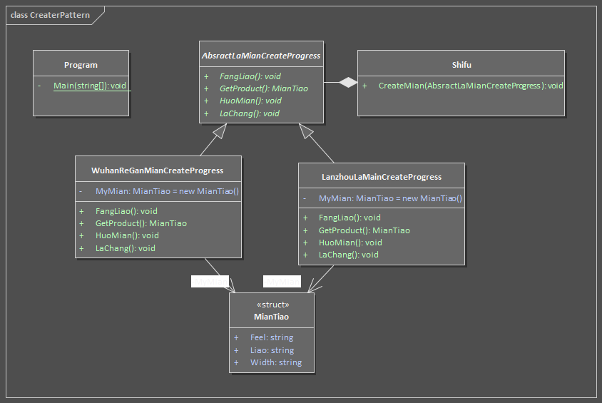

# 建造者模式

当一个复杂对象的创建，要求创建算法和表示代码分离时，使用建造者模式。  

比如，做一碗拉面（有嚼劲二细少辣多醋），不管是二细还是韭页，不管是辣还是不辣还是嚼劲咋样，都有一些固定的创建顺序。  
基类抽象出有共性的流程的接口，如揉面-拉长-放调料不管啥种类的拉面都要做。然后我们让具体的拉面（规定了所有共有细节的拉面）继承这个拉面创建的抽象基类，然后依次实现揉面（二细怎么揉），拉长（拉成多宽），放料（醋和辣椒放多少）。然后我们通过厨师实例来依次执行这些被实现的流程，最终产出一碗二细拉面。对于吃面者，只需要提供需要啥洋的面，而不是怎么做，怎么做是由这种面决定的，拉面师傅按照这种方式做而已。  

