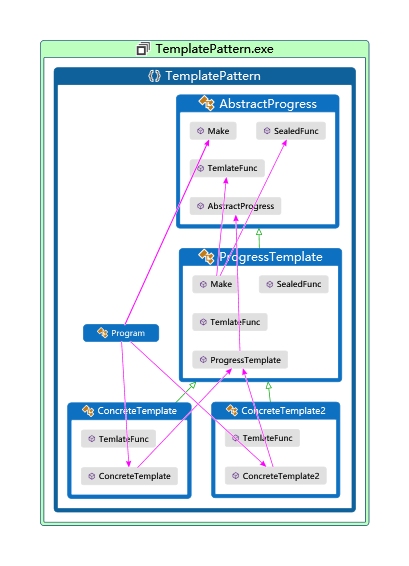

# 模板方法模式

>GOF：定义一个操作中的基本骨架，而将算法的一些步骤延迟到子类，可以使得子类在不改变算法结构的情况下重定义该算法的某些特定步骤。  

## 示例代码

```cs
using System;

namespace TemplatePattern {
    class Program {
        static void Main(string[] args) {
            var obj = new ConcreteTemplate();
            obj.Make();
            var obj2 = new ConcreteTemplate2();
            obj2.Make();
        }
    }

    /// <summary>
    /// 鉴于C#sealed只能密封重写的实现，所以提升所有方法到这个抽象类种。以便禁止子类修改一些方法
    /// </summary>
    public abstract class AbstractProgress {
        public abstract void Make();

        protected abstract void SealedFunc();
        public abstract void TemlateFunc();
    }

    public abstract class ProgressTemplate:AbstractProgress {
        public sealed override void Make() {
            TemlateFunc();
            SealedFunc();
            Console.WriteLine("end");
        }

        public override abstract void TemlateFunc();

        /// <summary>
        /// C#种sealed必须和override配合，不能直接修饰方法
        /// </summary>
        protected sealed override void SealedFunc() {
            Console.WriteLine("固定流程");
        }
    }

    public class ConcreteTemplate : ProgressTemplate {
        public override void TemlateFunc() {
            Console.WriteLine("可更换流程");
        }
    }

    public class ConcreteTemplate2 : ProgressTemplate {
        public override void TemlateFunc() {
            Console.WriteLine("更换流程2");
        }
    }
}

//可更换流程
//固定流程
//end
//更换流程2
//固定流程
//end

```

## UML

