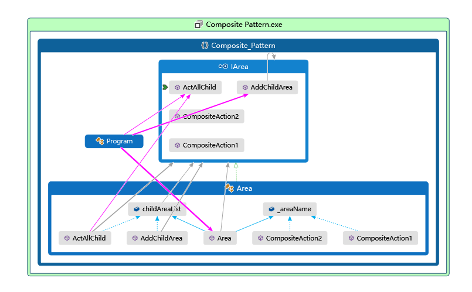

# 组合模式

## GOF说

> 将对象组成树状结构，使得单个对象和组合对象具有一致的访问性。  

## 举例

当很多对象，大致行为相同。如：公司和附属公司都有执行业务，总结工作，招聘等。此时如果使用附属公司继承总公司则会导致，客户端使用时需要判断他们的类型。那么可以使用组合模式。  
多个附属公司作为总公司的成员，附属公司也可以有很多附属，层层嵌套。所有的公司继承一个抽象的公司行为的基类。  

示例

```cs
using System;
using System.Collections.Generic;

namespace Composite_Pattern {
    class Program {
        static void Main(string[] args) {
            IArea Earth = new Area("地球");

            IArea China = new Area("种花家");
            IArea HongKong = new Area("香港");
            IArea ShangHai = new Area("上海");
            IArea QingDao = new Area("青岛");
            IArea LianYunGang = new Area("连云港");


            IArea US = new Area("美利坚");
            IArea NewYork = new Area("纽约");
            IArea HuaShenTown = new Area("华盛顿");
            IArea JiaLiFnYa = new Area("加利福尼亚");
            IArea GuiGu = new Area("硅谷");

            QingDao.AddChildArea(LianYunGang);
            JiaLiFnYa.AddChildArea(GuiGu);

            US.AddChildArea(NewYork, HuaShenTown, JiaLiFnYa);
            China.AddChildArea(HongKong, ShangHai, QingDao);

            Earth.AddChildArea(China, US);

            // 一致的访问性，可以访问所有
            Earth.ActAllChild();
        }
    }

    public interface IArea {
        void AddChildArea(params IArea[] addedComposites);
        void CompositeAction1();
        void CompositeAction2();

        void ActAllChild(int depth = 0);

    }
    public class Area : IArea {
        private List<IArea> childAreaList = new List<IArea>();
        protected string _areaName;
        public Area(string name) {
            _areaName = name;
        }

        public void CompositeAction1() {
            Console.WriteLine($"这是{_areaName}的行为1");
        }

        public void CompositeAction2() {
            Console.WriteLine($"这是{_areaName}的行为2");
        }
        public void AddChildArea(params IArea[] addedComposites) {
            childAreaList.AddRange(addedComposites);
        }

        public void ActAllChild(int depth = 0) {
            Console.WriteLine(new String('=', depth) + "我是 " + _areaName);
            foreach (var item in childAreaList) {
                item.ActAllChild(depth + 2);
            }
        }
    }
}

// 我是 地球
//==我是 种花家
//====我是 香港
//====我是 上海
//====我是 青岛
//======我是 连云港
//==我是 美利坚
//====我是 纽约
//====我是 华盛顿
//====我是 加利福尼亚
//======我是 硅谷
//请按任意键继续. . .

```

代码图：  
